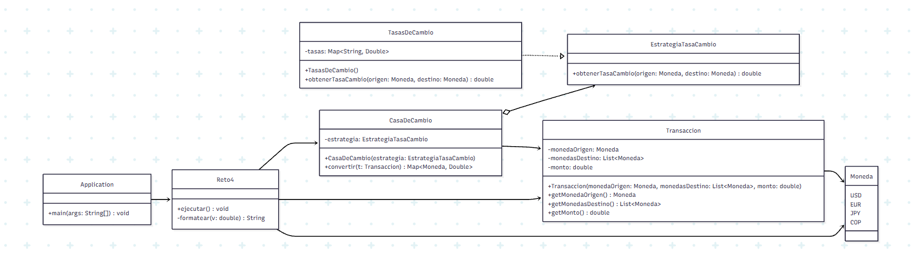
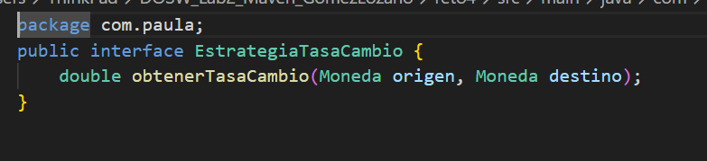
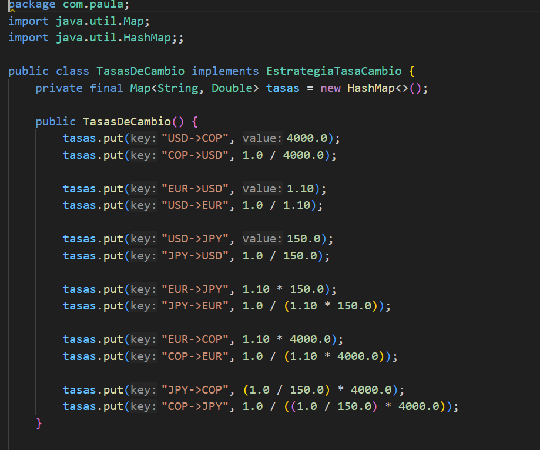
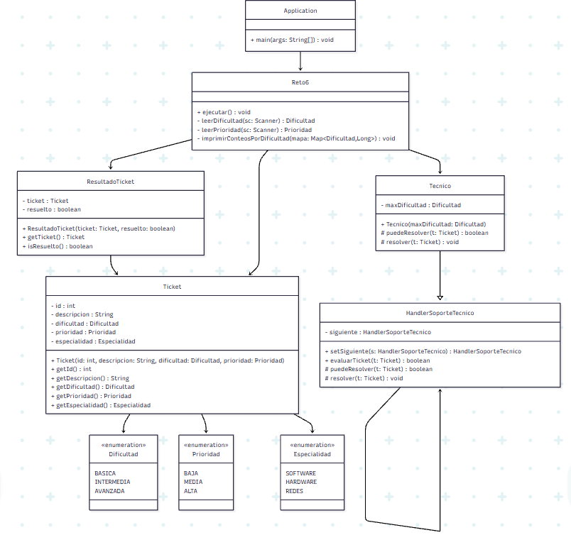
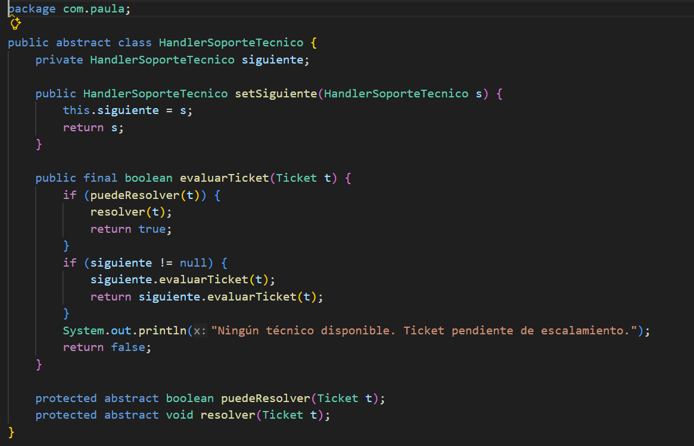

# Laboratorio 2 - Patrones de diseño + Maven

**Autoras: Paula Valentina Lozano, Ángela Gómez**

## RETO 3 - El problema del Reino de los Vehículos – Patrón comportamental 

**Diagrama de clases**

Diagrama de clases realizado en Mermaid 

Nota: El diagrama fue apoyado del código UML brindado por ChatGPT. 

**Descripción**

Este problema maneja varios tipos de vehículos (usados para agua, tierra o aire), y viene en varias categorías que son ecónomicas, lujo y usados. El usuario puede elegir varios tipo de vehículos y al final se le entregará un resumen de los que pidió con los valores pertinentes dependiendo de la categoría que seleccionó. 

Para comenzar se aplicó un patrón de diseño de Strategy, ya que hacemos uso de las interaces para facilitar el manejo y la creación de objetos dependiendo de la opción que vaya eligiendo el usuario. Así manejamos los cambios en los precios, velocidad y demás características sin la necesidad de llenar los métodos con if else. Acá el cómo cambian esas características es delegado a las categorías que implementan la interfaz de CategoryStrategy. 

**Manejo de casos usando switch en el Main**

**Interfaz puntual que establece métodos básicos**

**Implementación de interfaz hacia cada categoría**

Económico:

De lujo:

Usado:

Por otro lado, también se utilizó el patrón Composite, el cual nos ayuda a manejar los objetos de forma individual (un solo carro por ejemplo) o cómo un grupo de vehículos el cual comparte el mismo tipo de características. Este patrón es posible de ver en la interfaz de VehicleComponent y luego como Order es del tipo VehicleComponent y asimismo guarda elementos de este tipo abstracto. 

Para complementar la estructura de las clases y cómo estas delegan sus funciones dependiendo de las opciones y categorías de vehículos, se usó también una clase abstracta llamada AbstractVehicle, que aunque en la vida real un vehículo abstracto no tiene gran relevancia o sentido, las clases puntuales como Car y Helicopter extienden esta clase, agregando sentido y datos pertinentes a los diferentes vehículos individualmente. 

Clase abstracta que establece características básicas que debe tener cualquier tipo de vehículo:

## Pruebas de unidad

Para complementar el ejercicio de código se decidió implementar pruebas de unidad con ayuda de ChatGPT para tratar casos bordes y hacerlos lo más robustos y pertinentes posibles. A continuación se muestran los resultados de estas pruebas, haciendo uso de la estructura del arquetipo de Maven, en donde usamos JUnit y logramos correr las pruebas en su carpeta correspondiente. 

## RETO 4 - El Café Personalizado - Patrón Estructural 

**Patrón de Diseño**

Comportamental

**Patrón Utilizado**

Strategy

**Justificación**
En este reto el problema principal era que anteriormente se utilizaba una misma tasa de cambio para todas las monedas, lo cual generaba errores y pérdidas. El nuevo sistema debía permitir convertir distintas monedas (USD, EUR, JPY, COP, etc.) utilizando la tasa real correspondiente, además de aceptar múltiples transacciones.

Identificamos que el comportamiento que cambia en el sistema es la forma en que se calcula la conversión según la moneda destino. Cada moneda puede tener una tasa distinta y una lógica diferente de conversión.

Si hubiéramos implementado todas las conversiones dentro de una sola clase con múltiples condicionales (if o switch), el sistema habría quedado fuertemente acoplado y sería difícil de extender si en el futuro se agregan nuevas monedas.

Por esta razón utilizamos el patrón Strategy, ya que nos permite encapsular cada forma de conversión en una estrategia independiente. De esta manera el sistema puede cambiar dinámicamente la forma en que convierte sin modificar su estructura principal.

**Aplicación**

Definimos una interfaz llamada EstrategiaTasaCambio, que representa el contrato común para realizar una conversión.

Luego implementamos la lógica concreta en clases que representan la conversión específica de cada moneda utilizando las tasas correspondientes definidas en TasasDeCambio.

La clase CasaDeCambio no realiza directamente la conversión; en su lugar, recibe o selecciona la estrategia adecuada y delega el cálculo a dicha estrategia.

El flujo general funciona así:

 - El usuario ingresa la cantidad y la moneda origen.

 - Se selecciona la moneda destino.

 - Se asigna la estrategia de conversión correspondiente.

 - Se ejecuta la conversión.

 - Se muestra tanto el valor original como el convertido.

 - Para manejar múltiples transacciones utilizamos streams, lo que permitió:

 - Procesar listas de transacciones.

 - Calcular totales por moneda.

 - Mostrar resúmenes finales de manera clara y funcional.

---

**Estructura principal del diseño**

`Moneda:` representa los tipos de moneda disponibles.
`Transaccion:` encapsula la información de cada operación realizada.
`EstrategiaTasaCambio:` interfaz que define el método de conversión.
`TasasDeCambio: `contiene las tasas reales utilizadas por las estrategias.
`CasaDeCambio:` coordina el proceso y aplica la estrategia seleccionada.

Para reforzar la comprensión del patrón Strategy revisamos material visto en clase y ejemplos de apoyo. La organización del flujo principal y la estructura del método main se apoyó parcialmente con herramientas de IA, con el objetivo de mantener claridad y modularidad en la ejecución, revisando siempre el código antes de integrarlo.

## RETO 5 

**Diagrama de clases**

Diagrama de clases realizado en Mermaid. 

Nota: El diagrama fue apoyado del código UML brindado por ChatGPT. 

**Descripción**

Para este ejercicio nos piden realizar un sistema efectivo y práctico de añadir diferentes tipos de toppings a un número determinado de cafés (el usuario elige los toppings y número de cafés). 

Aunque al comienzo se tenía planeado aplicar el patrón Build para la creación de los diferentes cafés con sus toppings respectivos, nos dimos cuenta que era mejor aplicarle el patrón Decorator, ya que la clave está en que siempre tendremos el mismo café básico y que de ahí partimos a "decorarlo" con los toppings. 

Al tener una base estándar del café, acá estamos extendiendo el pedido inicial, en vez de modificar los cafés directamente. Por esta razón, al crear una interfaz llamada Coffee estamos estableciendo métodos puntuales, la cual esta después es implementada por BaseCoffee y CoffeeDecorator.

**Interfaz coffee (base)**

**Implementación de la interfaz**

Esto genera una clase de "envoltura", en donde partimos de tener un objeto tipo Café, y este es envuelto en otros objetos tipo café que serían los toppings. Acá estamos manteniendo el principio de O de SOLID, Open for extension closed for modification. 

**Ejemplo de clase concreta**

**Estructura del main**

**Ejemplo resultado**

## Pruebas de unidad

Para complementar el ejercicio de código se decidió implementar pruebas de unidad con ayuda de ChatGPT para tratar casos bordes y hacerlos lo más robustos y pertinentes posibles. A continuación se muestran los resultados de estas pruebas, haciendo uso de la estructura del arquetipo de Maven, en donde usamos JUnit y logramos correr las pruebas en su carpeta correspondiente. 

## RETO 6

**Diagrama de clases**

**Enfoque del diseño**

El reto exigía evitar el acoplamiento directo entre el ticket y un técnico específico, y permitir que la decisión de quién resuelve el problema sea dinámica.

**Categoría del patrón**

Comportamental

**Patrón aplicado**

Chain of Responsibility 

**Justificación del patrón**
El problema principal consistía en que un ticket no debe saber directamente qué técnico lo resolverá. En su lugar, el ticket debe ser procesado por una cadena de técnicos hasta que alguno cumpla con las condiciones necesarias para resolverlo.

Si hubiéramos implementado la lógica con múltiples condicionales o asignaciones directas (por ejemplo: “si dificultad es básica, entonces técnico X”), el sistema habría quedado rígido y poco escalable.

El patrón Chain of Responsibility permite que múltiples objetos tengan la oportunidad de manejar una solicitud, pasando la responsabilidad al siguiente en la cadena si el actual no puede resolverla. Vimos que esto encaja perfectamente con el escenario del soporte técnico.

**Cómo lo aplicamos en la solución**

Definimos una clase base abstracta llamada HandlerSoporteTecnico, que representa un eslabón dentro de la cadena. Esta clase contiene una referencia al siguiente handler.

Cada técnico hereda o implementa esta estructura y define:

 - Su especialidad.
 - El nivel máximo de dificultad que puede resolver.
 - El nivel máximo de prioridad que puede atender.

El flujo de procesamiento funciona así:
 - Se crea el ticket con su descripción, dificultad y prioridad.
 - El ticket se envía al primer técnico de la cadena.
 - Si el técnico puede resolverlo según sus reglas, lo atiende.
 - Si no puede, lo pasa automáticamente al siguiente técnico.
 - Si ningún técnico lo puede resolver, el ticket queda pendiente de escalamiento.

Este diseño permite que el sistema decida dinámicamente quién resuelve cada ticket sin necesidad de que el ticket conozca la estructura completa del soporte.

**Uso de streams**

Los streams se utilizaron para:

1. Contar la cantidad de tickets resueltos por cada nivel.
2. alcular estadísticas finales.
3. Generar resúmenes de procesamiento.
4. Determinar tickets pendientes.

Esto permitió mantener el código limpio y evitar estructuras repetitivas. Sin emabargo, hubo un gran apoyo de IA en estas partes.

**Clases principales del diseño**

Ticket: representa la solicitud del cliente, con dificultad y prioridad.

Dificultad: enum que clasifica el nivel técnico del problema.

Prioridad: enum que define el nivel de urgencia.

Especialidad: enum que determina el tipo de problemas que puede resolver un técnico.

HandlerSoporteTecnico: estructura base de la cadena.

Tecnico: implementa la lógica de validación y resolución.

Reto6: encapsula la ejecución del reto.

Application: llama la ejecución desde el main.

Para reforzar la comprensión del patrón revisamos ejemplos prácticos y material de apoyo adicional. La organización del flujo principal y del método main se estructuró de forma modular, apoyándonos parcialmente en herramientas de IA para mantener claridad y orden en la ejecución, siempre validando el funcionamiento del código antes de integrarlo.

