# Laboratorio 2 - Patrones de diseño + Maven

**Autoras: Paula Valentina Lozano, Ángela Gómez**

## RETO 3 - El problema del Reino de los Vehículos – Patrón comportamental 

**Diagrama de clases**

Diagrama de clases realizado en Mermaid 

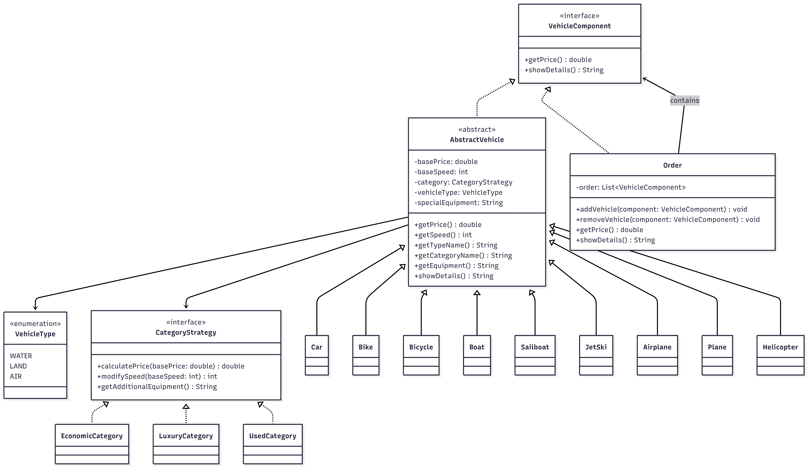

Nota: El diagrama fue apoyado del código UML brindado por ChatGPT. 

**Descripción**

Este problema maneja varios tipos de vehículos (usados para agua, tierra o aire), y viene en varias categorías que son ecónomicas, lujo y usados. El usuario puede elegir varios tipo de vehículos y al final se le entregará un resumen de los que pidió con los valores pertinentes dependiendo de la categoría que seleccionó. 

Para comenzar se aplicó un patrón de diseño de Strategy, ya que hacemos uso de las interaces para facilitar el manejo y la creación de objetos dependiendo de la opción que vaya eligiendo el usuario. Así manejamos los cambios en los precios, velocidad y demás características sin la necesidad de llenar los métodos con if else. Acá el cómo cambian esas características es delegado a las categorías que implementan la interfaz de CategoryStrategy. 

**Manejo de casos usando switch en el Main**

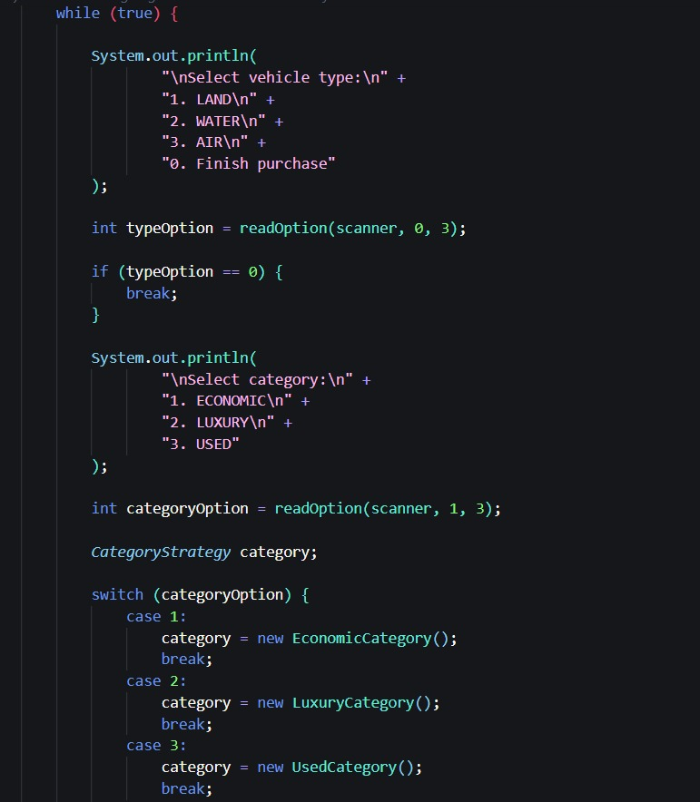

**Interfaz puntual que establece métodos básicos**

**Implementación de interfaz hacia cada categoría**

Económico:

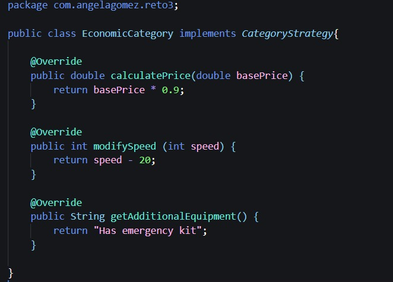

De lujo:

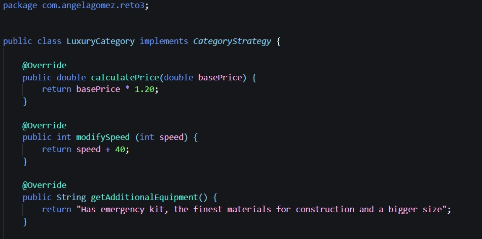

Usado:

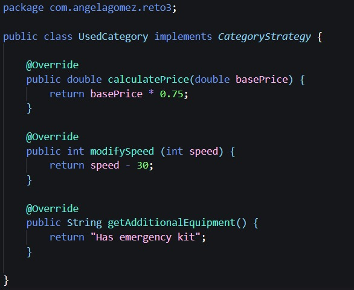

Por otro lado, también se utilizó el patrón Composite, el cual nos ayuda a manejar los objetos de forma individual (un solo carro por ejemplo) o cómo un grupo de vehículos el cual comparte el mismo tipo de características. Este patrón es posible de ver en la interfaz de VehicleComponent y luego como Order es del tipo VehicleComponent y asimismo guarda elementos de este tipo abstracto. 

Para complementar la estructura de las clases y cómo estas delegan sus funciones dependiendo de las opciones y categorías de vehículos, se usó también una clase abstracta llamada AbstractVehicle, que aunque en la vida real un vehículo abstracto no tiene gran relevancia o sentido, las clases puntuales como Car y Helicopter extienden esta clase, agregando sentido y datos pertinentes a los diferentes vehículos individualmente. 

Clase abstracta que establece características básicas que debe tener cualquier tipo de vehículo:

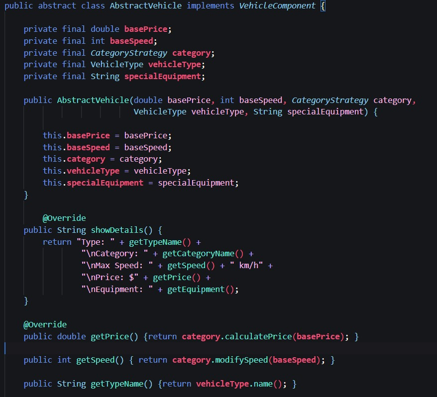

## Pruebas de unidad

Para complementar el ejercicio de código se decidió implementar pruebas de unidad con ayuda de ChatGPT para tratar casos bordes y hacerlos lo más robustos y pertinentes posibles. A continuación se muestran los resultados de estas pruebas, haciendo uso de la estructura del arquetipo de Maven, en donde usamos JUnit y logramos correr las pruebas en su carpeta correspondiente. 

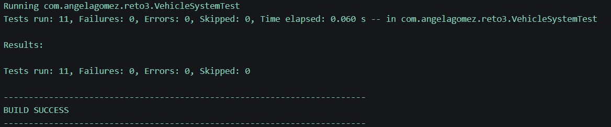

## RETO 4 - El Café Personalizado - Patrón Estructural 

**Diagrama de clases**

**Descripción**

## Pruebas de unidad

## RETO 5 

**Diagrama de clases**

Diagrama de clases realizado en Mermaid. 

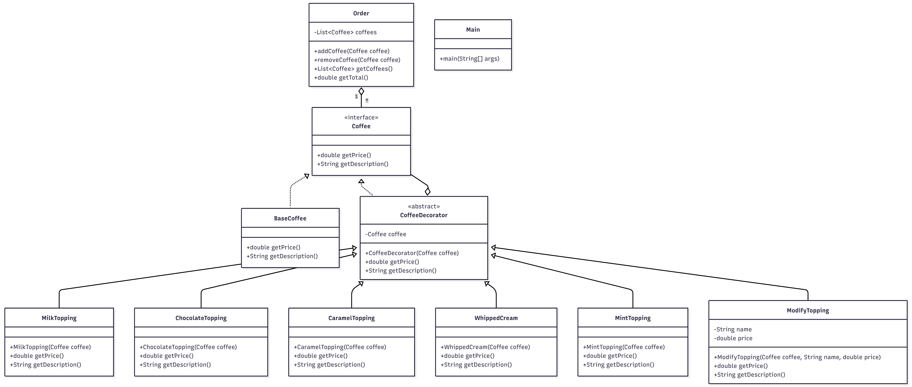

Nota: El diagrama fue apoyado del código UML brindado por ChatGPT. 

**Descripción**

Para este ejercicio nos piden realizar un sistema efectivo y práctico de añadir diferentes tipos de toppings a un número determinado de cafés (el usuario elige los toppings y número de cafés). 

Aunque al comienzo se tenía planeado aplicar el patrón Build para la creación de los diferentes cafés con sus toppings respectivos, nos dimos cuenta que era mejor aplicarle el patrón Decorator, ya que la clave está en que siempre tendremos el mismo café básico y que de ahí partimos a "decorarlo" con los toppings. 

Al tener una base estándar del café, acá estamos extendiendo el pedido inicial, en vez de modificar los cafés directamente. Por esta razón, al crear una interfaz llamada Coffee estamos estableciendo métodos puntuales, la cual esta después es implementada por BaseCoffee y CoffeeDecorator.

Esto genera una clase de "envoltura", en donde partimos de tener un objeto tipo Café, y este es envuelto en otros objetos tipo café que serían los toppings. Acá estamos manteniendo el principio de O de SOLID, Open for extension closed for modification. 

**Interfaz coffee (base)**

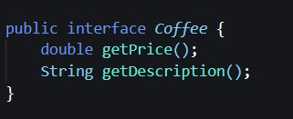

**Implementación de la interfaz**

**Ejemplo de clase concreta**

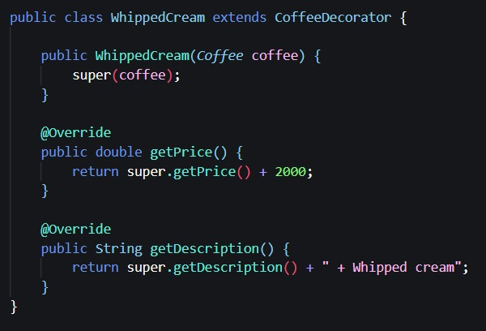

**Estructura del main**

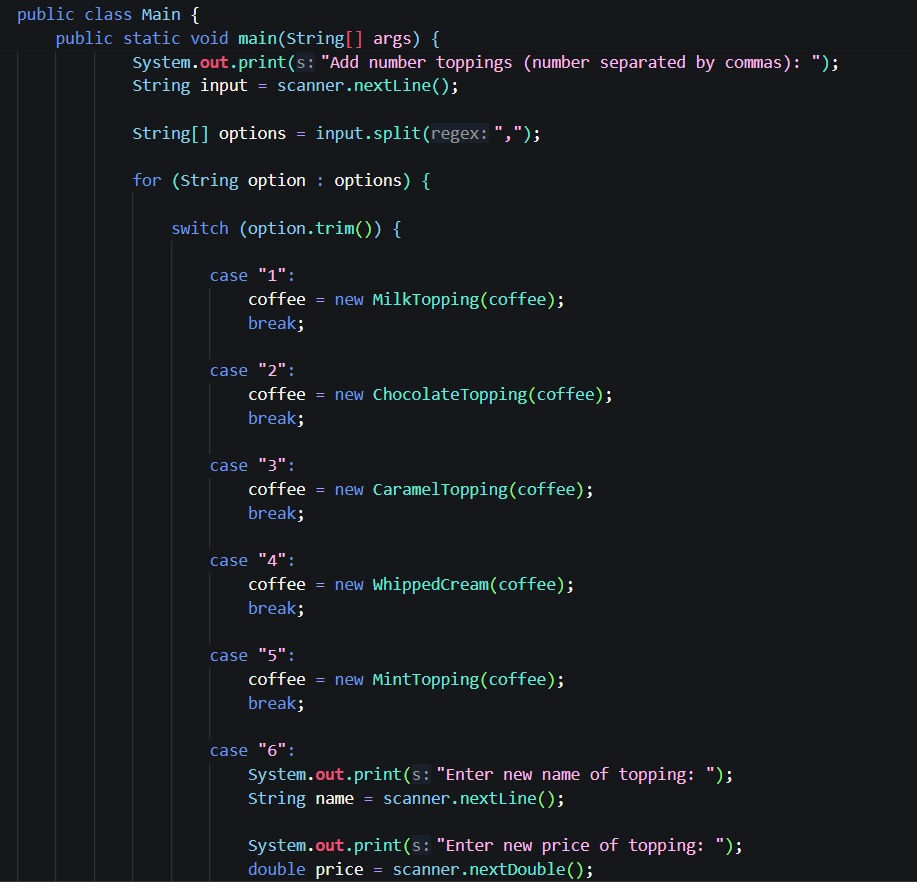

**Ejemplo resultado**

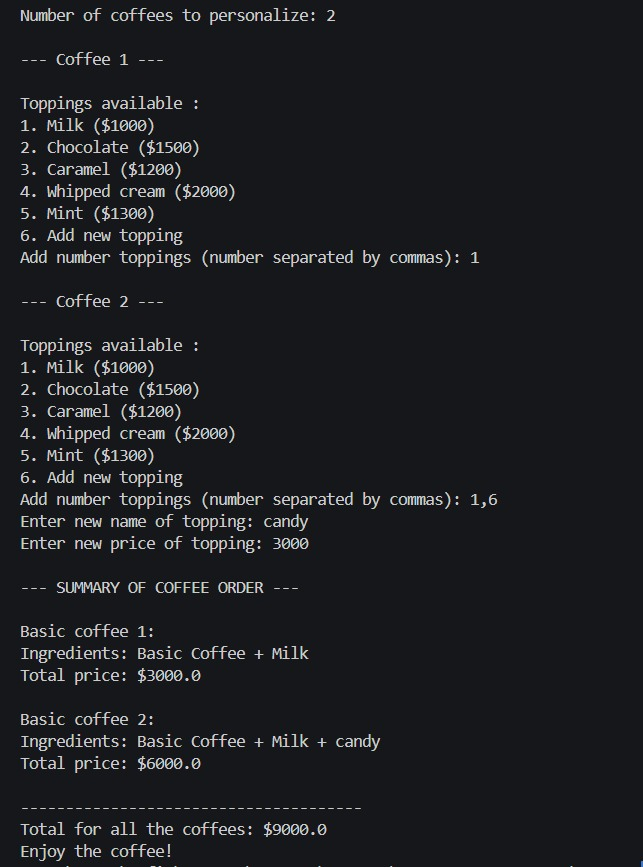

## Pruebas de unidad

Para complementar el ejercicio de código se decidió implementar pruebas de unidad con ayuda de ChatGPT para tratar casos bordes y hacerlos lo más robustos y pertinentes posibles. A continuación se muestran los resultados de estas pruebas, haciendo uso de la estructura del arquetipo de Maven, en donde usamos JUnit y logramos correr las pruebas en su carpeta correspondiente. 

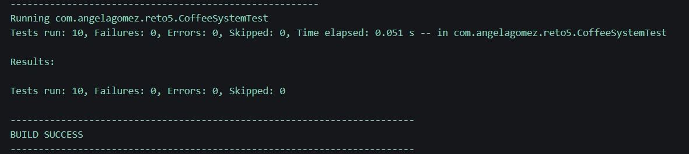

## RETO 6

**Diagrama de clases**

**Descripción**

## Pruebas de unidad

## RETO 7

**Diagrama de clases**

**Descripción**

## Pruebas de unidad

## RETO 8

**Diagrama de clases**

**Descripción**

## Pruebas de unidad

